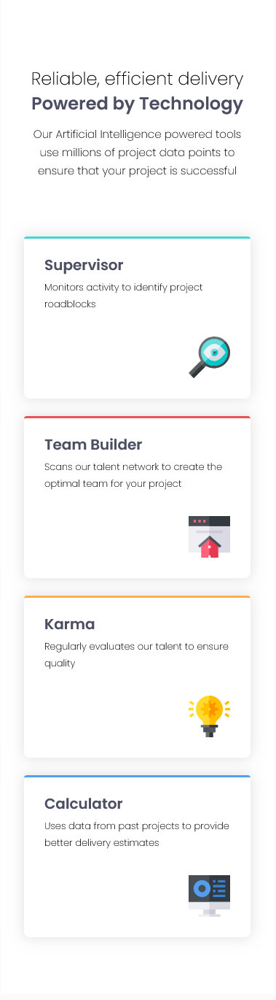
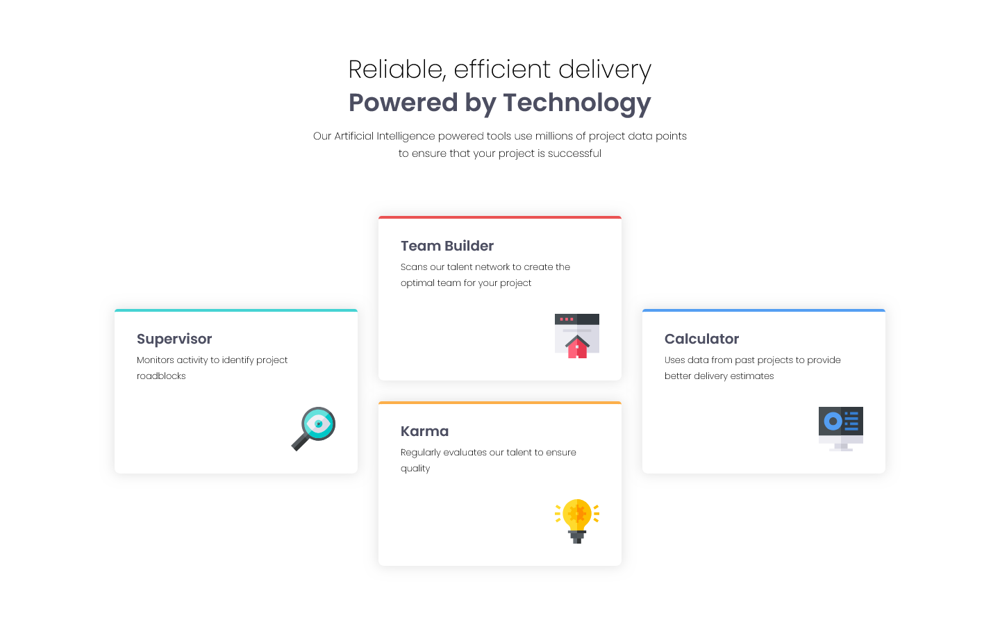

# Frontend Mentor - Four card feature section solution

This is a solution to the [Four card feature section challenge on Frontend Mentor](https://www.frontendmentor.io/challenges/four-card-feature-section-weK1eFYK). Frontend Mentor challenges help you improve your coding skills by building realistic projects. 

## Table of contents

  - [The challenge](#the-challenge)
  - [Screenshot](#screenshot)
  - [Links](#links)
  - [Built with](#built-with)
  - [What I learned](#what-i-learned)
  - [Continued development](#continued-development)
  - [Author](#author)

### The challenge

Users should be able to:

- View the optimal layout for the site depending on their device's screen size

### Screenshot





### Links

- Solution URL: [Github page](https://github.com/cacesasa/four-card-feature-section)
- Live Site URL: [Github pages live site URL](https://your-live-site-url.com)

## My process

### Built with

- Semantic HTML5 markup
- CSS custom properties
- Flexbox
- CSS Grid
- Mobile-first workflow


### What I learned

I learned how to use CSS grid property grid-temple-areas to organized the cards.

```css
.card_wrapper {
        width: 69.375rem;
        gap: 1.875rem;
        grid-template-columns: repeat(3, 1fr);
        grid-template-rows: repeat(2, 1fr);
        grid-template-areas: "supervisor team_builder calculator"
                             "supervisor karma calculator";
    }
```

### Continued development

I would like to keep improving my CSS knowledge by creating responsive web pages.

## Author

- Frontend Mentor - [@cacesasa](https://www.frontendmentor.io/profile/cacesasa)
- Twitter - [@cacesasa](https://www.twitter.com/cacesasa)
